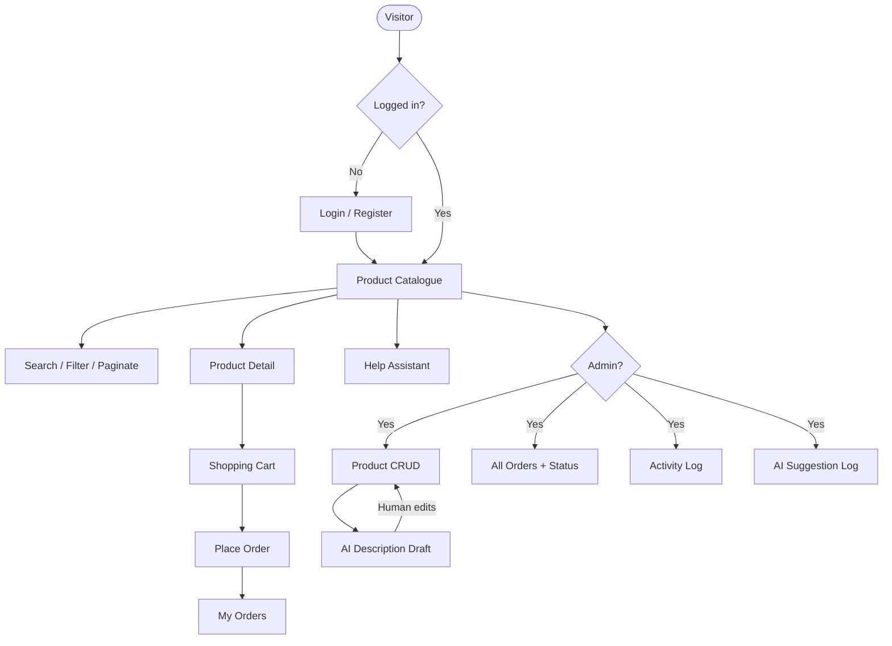

# Page Flow — Cornerstone Retail

## Page list

| Page | Route | Access |
|------|-------|--------|
| Login | `login` | Guest |
| Register | `register` | Guest |
| Catalogue | `products.index` | All |
| Product detail | `products.show` | All |
| Add / edit product | `products.create`, `products.edit` | Admin |
| Cart | `cart.index` | User |
| Orders list | `orders.index` | User (own) / Admin (all) |
| Order detail | `orders.show` | Owner / Admin |
| Help | `help.index` | All |
| Activity log | `admin.activity` | Admin |
| AI log | `admin.aiLog` | Admin |
