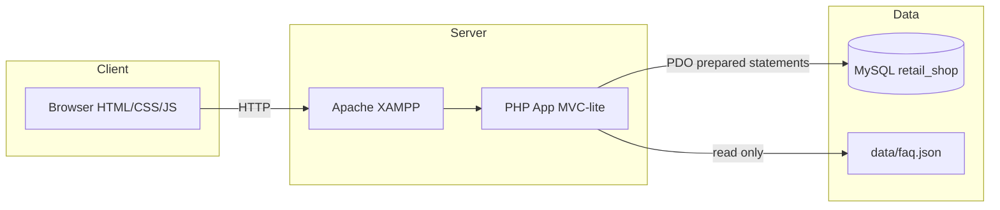
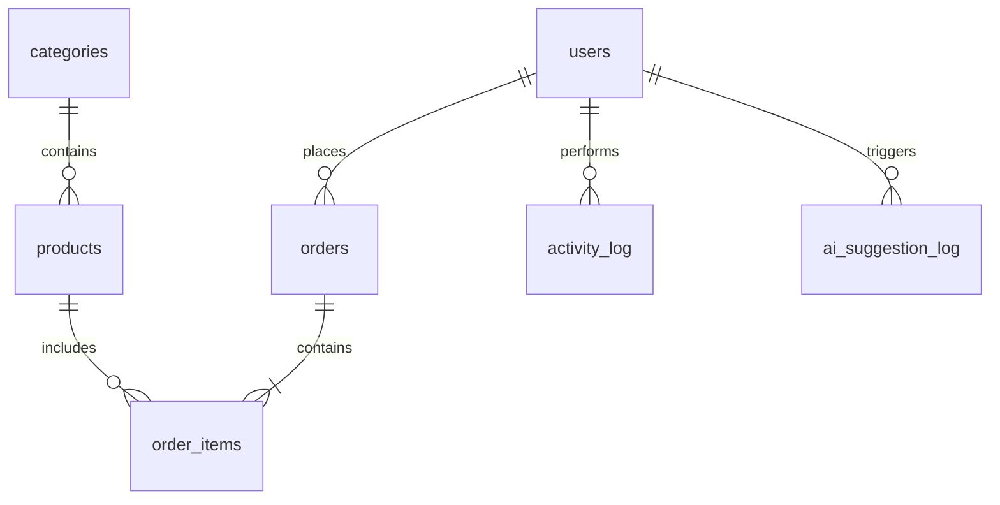

# System Design — Cornerstone Retail

## Architecture diagram



## ERD (summary)

**Entities:** users, categories, products, orders, order_items, activity_log, ai_suggestion_log

- **users** 1—* **orders**
- **products** *—1 **categories**
- **orders** 1—* **order_items** *—1 **products**
- **users** audit **products** and **orders** via created_by / updated_by

See `database/schema.sql` or root `database.sql` for full DDL.



## Folder structure

```
retail-shop/
├── config/                 # app.php, database.php
├── data/faq.json           # Help assistant knowledge base
├── database/
│   ├── schema.sql
│   └── seed.sql
├── database.sql            # Full submission import
├── docs/                   # Assessment documentation
├── public/
│   ├── index.php           # Front controller
│   ├── assets/css|js/
│   └── assets/uploads/products/
├── src/
│   ├── Controllers/
│   ├── Models/
│   ├── Services/
│   ├── Auth.php, Database.php, Router.php, ...
├── views/
│   ├── layout/, auth/, products/, orders/, ...
│   └── partials/
└── README.md
```

## Page flow

See `docs/page-flow.md` for user journey diagram.

## API / routes

This application uses server-rendered pages with a front controller (`public/index.php`). Logical routes:

| Method | Route | Action |
|--------|-------|--------|
| GET | login, register | Auth forms |
| POST | login, register | Authenticate / create user |
| GET | products.index | List + search/filter/paginate |
| GET/POST | products.create, products.update, products.delete | Product CRUD (admin) |
| GET/POST | cart.* | Cart management |
| GET | orders.index, orders.show | View orders |
| POST | orders.checkout, orders.updateStatus | Create order / admin status |
| GET/POST | help.index, help.ask | Help assistant |
| POST | ai.suggestDescription, ai.logAcceptance | Description AI (admin) |

## Security design

- Session-based authentication after `password_verify`
- `Auth::requireAdmin()` on privileged routes
- CSRF hidden token on POST forms
- PDO with emulated prepares disabled
- Output escaped via `e()` helper
